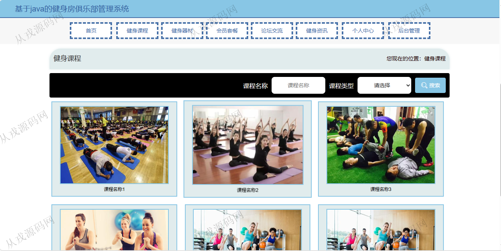
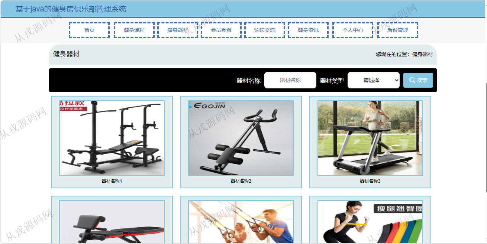
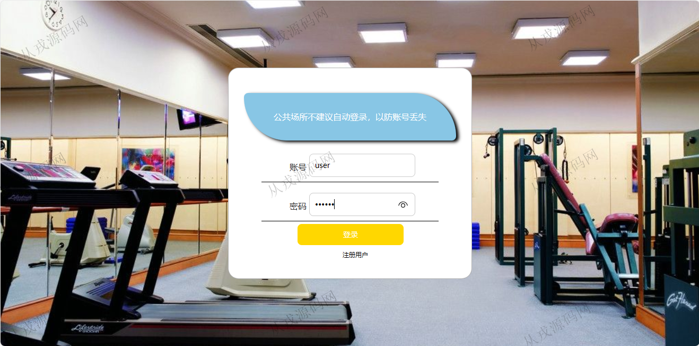
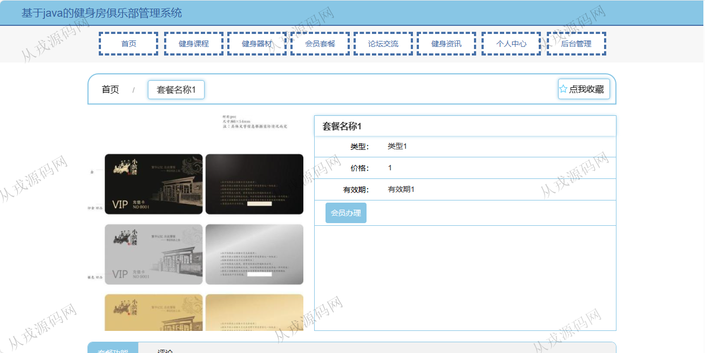
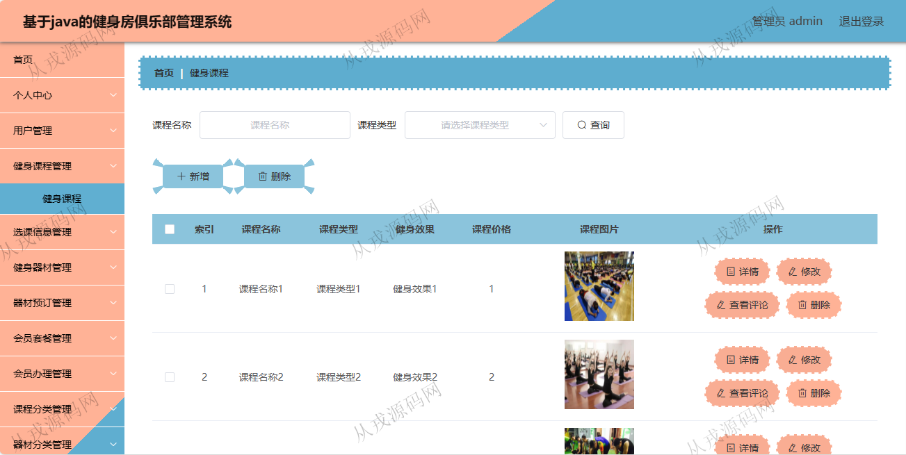
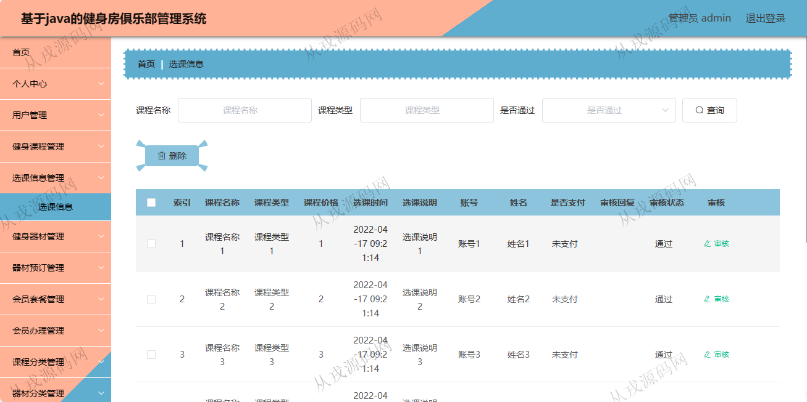
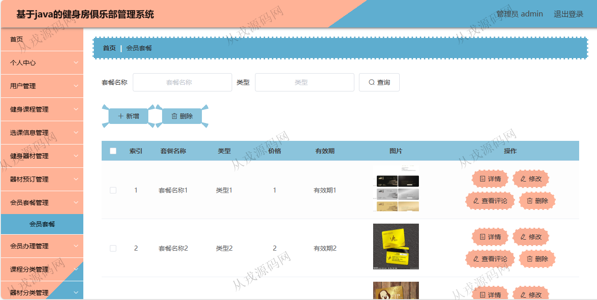
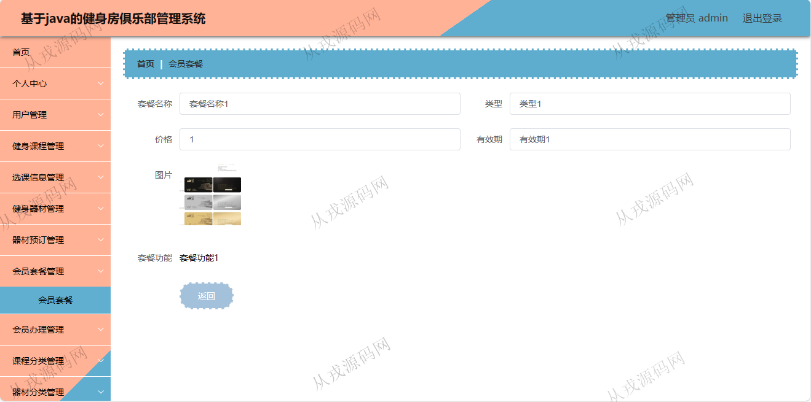

<h1 align="center">113.健身房俱乐部管理系统</h1>

 获取sql文件 QQ: 386869957 QQ群: 377586148 

 [推荐站点: 从戎源码网](https://armycodes.com/) 

## 简介

> 本代码来源于网络,仅供学习参考使用!
>
> 提供1.远程部署/2.修改代码/3.设计文档指导/4.框架代码讲解等服务
> 
> 用户端访问地址：http://localhost:8080/ssmzbr14/front/index.html
> 
> 用户：user 123456
>
> 管理端访问地址：http://localhost:8080/ssmzbr14/admin/dist/index.html#/index
>
> 管理员 : admin 123456

## 项目介绍
基于ssm的健身房俱乐部管理系统：前端 vue、elementui，后端 maven、springmvc、spring、mybatis，角色分为管理员、用户；集成健身课程、健身器材、会员套餐、健身资讯等功能于一体的系统。

## 功能介绍

### 用户

- 基本功能：登录、注册、退出
- 网站首页：主导航栏，轮播图，健身课程推荐，健身器材推荐，健身资讯
- 健身课程：课程列表展示，课程搜索，课程详情，赞一下，踩一下，课程评论，在线选课
- 健身器材：健身器材列表展示，器材搜索，器材详情，收藏，在线预订
- 会员套餐：套餐列表展示，套餐搜索，套餐详情，收藏，在线会员办理
- 论坛交流：发布帖子，帖子关键词搜索，帖子详情
- 个人中心：个人信息查看与修改，我的发布信息，我的收藏列表

### 管理员

- 个人中心：个人信息查看与修改，密码修改
- 用户管理：用户信息的增删改查
- 健身课程管理：课程信息的增删改查
- 选课管理：用户端选课的信息，选课列表查询，多条件搜索查询，审核
- 健身器材管理：器材信息的增删改查
- 器材预订：用户预定器材的列表信息，详情，删除，审核
- 会员套餐：套餐信息的增删改查
- 会员办理管理：用户在线办理会员后，管理员在后台进行查看和审核
- 课程分类：分类信息的增删改查
- 论坛交流：查看前台用户发布的帖子，修改，删除，查看评论

## 环境

- <b>IntelliJ IDEA 2021.3</b>

- <b>Mysql 5.7.26</b>

- <b>Tomcat 7.0.73</b>

- <b>JDK 1.8</b>

## 运行截图

